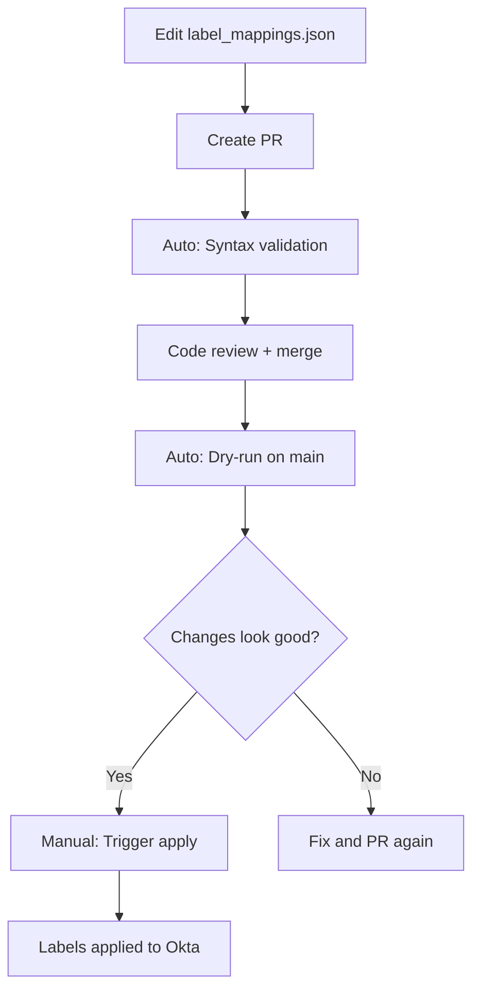

# Repository Review: Suggested Improvements

**Review Date:** 2025-11-10
**Reviewer:** Comprehensive Repository Analysis
**Repository:** Okta Terraform GitOps Complete Demo

---

## Executive Summary

This repository is a comprehensive GitOps demo for Okta Identity Governance with Terraform. While it demonstrates advanced patterns and includes extensive documentation, there are significant opportunities to simplify, consolidate, and improve the user experience for sales engineers and new users.

### Key Findings

**Strengths:**
- Comprehensive documentation (15+ markdown files)
- Well-structured environment-based architecture
- Strong GitOps patterns with PR validation
- Extensive workflow automation (32 workflows)
- Good security practices (environment isolation, AWS OIDC)

**Areas for Improvement:**
- **Workflow proliferation:** 32 workflows (13 environment-specific) creates confusion
- **Documentation overload:** Multiple overlapping docs without clear hierarchy
- **Complexity barriers:** Too many concepts to grasp for basic usage
- **Maintenance burden:** Log files in root, temporary directories committed
- **Naming inconsistency:** Mixed conventions across files
- **Error handling:** Generic error messages in critical paths

---

## Priority Matrix

| Priority | Count | Effort Impact |
|----------|-------|---------------|
| Critical | 5 | High user friction, blocks adoption |
| High | 12 | Significant improvement to UX |
| Medium | 18 | Quality of life improvements |
| Low | 8 | Nice to have |

**Total Suggestions:** 43

---

## Critical Priority

### C1. Workflow Proliferation - 32 Workflows is Overwhelming

**Problem:**
- 32 separate workflow files is extremely confusing for new users
- 13 workflows are LowerDeckLabs-specific (should be generic)
- Multiple workflows do similar things with slight variations
- No clear "start here" workflow for common tasks

**Impact:**
- New users don't know which workflow to run
- Sales engineers spend hours understanding workflow maze
- Maintenance nightmare (update logic in multiple places)
- High barrier to forking and customizing

**Proposed Solution:**
Create consolidated, environment-parameterized workflows:

**Before (32 files):**
```
lowerdecklabs-apply-owners.yml
lowerdecklabs-apply-labels.yml
lowerdecklabs-apply-admin-labels.yml
lowerdecklabs-sync-labels.yml
lowerdecklabs-export-oig.yml
lowerdecklabs-import.yml
lowerdecklabs-import-oig.yml
... and 25 more
```

**After (8-10 core workflows):**
```
# Core workflows (environment-aware)
import-resources.yml              (replaces 5 import workflows)
governance-management.yml          (replaces 6 governance workflows)
terraform-operations.yml          (consolidates plan/apply)
label-management.yml              (replaces 4 label workflows)
validation.yml                    (consolidates PR checks)

# Utility workflows (keep separate)
fix-bundle-campaign-errors.yml
admin-protection.yml
cleanup-imports.yml
```

**Implementation:**
- Use `environment` input parameter instead of hardcoded environment names
- Consolidate common operations with conditional steps
- Move utility operations to a single "utilities" workflow with operation selector

**Effort:** Large (2-3 days)
**Files Affected:** All 32 workflow files

**Related Files:**
- `.github/workflows/lowerdecklabs-*.yml` (13 files)
- `.github/workflows/import-*.yml` (4 files)
- `.github/workflows/terraform-*.yml` (5 files)

---

### C2. Documentation Hierarchy is Unclear

**Problem:**
- 15+ documentation files with overlapping content
- No clear "start here" path for different user types
- Critical information scattered across multiple files
- README vs CLAUDE.md vs DIRECTORY_GUIDE.md all explain similar concepts

**Impact:**
- Users read 3-4 docs to find one answer
- Conflicting information across docs (environments README vs main README)
- Critical prerequisites buried in separate file
- Sales engineers waste time navigating docs

**Proposed Solution:**

**Create clear documentation hierarchy:**

```
README.md (Quick Start - 5 min read)
├── "New to this repo? Start here"
├── Quick architecture diagram
├── "Choose your path" (by persona)
│   ├── Sales Engineer → SALES_ENGINEER_GUIDE.md
│   ├── Developer → DEVELOPER_GUIDE.md
│   └── Operations → OPS_GUIDE.md
└── "Core concepts in 3 minutes"

docs/
├── 00-GETTING-STARTED.md (replaces scattered content)
├── 01-ARCHITECTURE.md (consolidates 4 existing docs)
├── 02-WORKFLOWS.md (consolidated workflow guide)
├── 03-OIG-FEATURES.md (consolidates OIG docs)
├── 04-TROUBLESHOOTING.md (consolidates issues)
└── reference/
    ├── API_MANAGEMENT.md
    ├── AWS_BACKEND_SETUP.md
    └── CONTRIBUTING.md
```

**Consolidate:**
- README.md + DIRECTORY_GUIDE.md + environments/README.md → Single source of truth
- GITOPS_WORKFLOW.md + WORKFLOWS.md → Single workflow guide
- OIG_PREREQUISITES.md + TERRAFORMER_OIG_FAQ.md → OIG setup guide
- LESSONS_LEARNED.md + TROUBLESHOOTING_*.md → Troubleshooting guide

**Effort:** Medium (1-2 days)
**Files Affected:** 15+ markdown files

---

### C3. Root Directory Clutter with Logs and Temp Files

**Problem:**
- 8+ log files in repository root (sync.log, apply.log, import_oig.log, etc.)
- Temporary output files (apps_output.txt, labels_output.txt, orns_output.txt)
- Complete import directory committed (complete-import-20251111_002647/)
- JSON result files (label_application_results.json)

**Impact:**
- Confusing for new users cloning repo
- Accidental commits of sensitive data
- Cluttered git history
- Professional appearance compromised

**Proposed Solution:**

1. **Update .gitignore immediately:**
```gitignore
# Logs and temporary files
*.log
*_output.txt
*_results.json
complete-import-*/
sync_*.log
apply.log
import_*.log

# Keep exceptions
!docs/**/*.log
!examples/**/*.log
```

2. **Clean existing files:**
```bash
git rm *.log *_output.txt *_results.json
git rm -r complete-import-*
```

3. **Update scripts to output to logs/ directory:**
- Create `logs/.gitkeep`
- Modify scripts to write to `logs/` instead of root
- Add note in logs/README.md about purpose

**Effort:** Small (2-3 hours)
**Files Affected:** .gitignore, all scripts, root directory cleanup

---

### C4. No Clear "Hello World" Quick Start

**Problem:**
- Repo requires understanding: environments, workflows, GitHub secrets, Terraform, AWS, Python, OIG
- No simple "get started in 10 minutes" path
- Prerequisites scattered across multiple docs
- Assumption of advanced knowledge

**Impact:**
- Sales engineers abandon due to high initial complexity
- Cannot quickly demo to customers
- High time-to-first-success (hours vs minutes)
- Reduces adoption and forking

**Proposed Solution:**

**Create QUICKSTART.md:**

```markdown
# Quick Start - Running Your First Plan in 10 Minutes

## Prerequisites (3 minutes)
- [ ] GitHub account with Actions enabled
- [ ] Okta org with admin API token
- [ ] One of: Local Terraform install OR use GitHub Actions only

## Path 1: GitHub Actions Only (Easiest - 7 minutes)

1. **Fork this repository**
   Click "Fork" button above

2. **Add your Okta credentials** (3 minutes)
   - Go to Settings → Environments → New Environment
   - Name: "MyOrg"
   - Add 3 secrets: OKTA_API_TOKEN, OKTA_ORG_NAME, OKTA_BASE_URL
   [Screenshot with arrows]

3. **Run your first import** (2 minutes)
   - Go to Actions → "Import Resources"
   - Select "MyOrg"
   - Click "Run workflow"
   [Screenshot]

4. **See your results** (2 minutes)
   - Review generated files in environments/myorg/
   - View import summary in workflow output

✅ Success! You've imported your Okta org to code.

**Next Steps:**
- [Make your first change](docs/00-GETTING-STARTED.md#making-changes)
- [Understand the architecture](docs/01-ARCHITECTURE.md)
- [Set up OIG features](docs/03-OIG-FEATURES.md)

## Path 2: Local Development (15 minutes)
[Detailed local setup instructions]
```

**Effort:** Medium (1 day including screenshots)
**Files Affected:** New QUICKSTART.md, updated README.md

---

### C5. Environment Setup Confusion - Repository vs Environment Secrets

**Problem:**
- LESSONS_LEARNED.md documents critical issue with repository vs environment secrets (lines 257-340)
- Easy to make this mistake and create resources in wrong org
- No preventive documentation in setup guides
- Current setup instructions don't emphasize this enough

**Impact:**
- Resources created in wrong Okta org (happened in development)
- Data leakage between environments
- Security risk with wrong credentials
- Hard to debug when it happens

**Proposed Solution:**

1. **Add validation workflow:**
```yaml
# .github/workflows/validate-environment.yml
name: Validate Environment Configuration
# Runs on workflow_dispatch and weekly
# Checks:
# - Environment secrets exist
# - No conflicting repository secrets
# - Workflow files reference correct environment
# - Outputs clear report
```

2. **Add setup checklist to QUICKSTART.md:**
```markdown
## Critical Setup Verification

Run this checklist BEFORE first workflow:

- [ ] Repository secrets: Only AWS_ROLE_ARN (run: gh secret list)
- [ ] Environment secrets: OKTA_* for each environment (run: gh secret list -e MyOrg)
- [ ] Workflow files: All have `environment:` field set
- [ ] .gitignore: Includes *.log and temp files

[Provide commands to verify each]
```

3. **Update all workflow files with warning comments:**
```yaml
jobs:
  job-name:
    # CRITICAL: Must specify environment to use correct Okta secrets
    # Without this, workflow uses repository secrets (wrong org!)
    environment: ${{ inputs.environment }}
```

**Effort:** Medium (1 day)
**Files Affected:** All workflow files, setup documentation, new validation workflow

---

## High Priority

### H1. Workflow Naming is Inconsistent

**Problem:**
- Mixed naming patterns: lowercase-with-dashes vs CamelCase vs Environment-prefix
- Examples: `terraform-plan.yml` vs `lowerdecklabs-apply-owners.yml` vs `validate-pr.yml`
- Environment-specific workflows hardcode environment name

**Proposed Solution:**
Standardize to: `<action>-<resource>-<environment>.yml` pattern or environment-agnostic names

**Effort:** Small (4 hours with testing)
**Files:** All workflow files

---

### H2. No Workflow Documentation Map

**Problem:**
- 32 workflows with no visual map or decision tree
- Users don't know which workflow to use for their task
- WORKFLOWS.md exists but is outdated and incomplete

**Proposed Solution:**
Create workflow decision tree and categorized reference:

```markdown
# Which Workflow Should I Use?

## By Task

### "I want to import my Okta org"
→ Use: `import-resources.yml`
Parameters: environment, import_type

### "I want to apply changes"
→ Use: `terraform-operations.yml`
Parameters: environment, operation=apply

### "I want to manage labels"
→ Use: `label-management.yml`
Parameters: environment, operation=sync|apply|validate

[Continue for all common tasks]

## Workflow Reference

### Core Workflows (Use These)
- import-resources.yml - Import Okta resources
- terraform-operations.yml - Plan/Apply/Destroy
- label-management.yml - Governance labels

### Utility Workflows (Occasional Use)
- fix-bundle-campaign-errors.yml - Fix provider bug
- cleanup-imports.yml - Clean temp files

### Internal Workflows (Auto-triggered)
- validation.yml - PR checks
- terraform-plan.yml - Auto plan on push
```

**Effort:** Small (4 hours)
**Files:** docs/02-WORKFLOWS.md (new comprehensive version)

---

### H3. Script Documentation is Scattered

**Problem:**
- 30+ Python scripts with no central reference
- Some scripts have docstrings, some don't
- No "scripts/README.md" overview
- Users don't know which script does what

**Proposed Solution:**
Create scripts/README.md with categorized reference:

```markdown
# Scripts Reference

## Quick Reference

| Script | Purpose | Usage |
|--------|---------|-------|
| import_oig_resources.py | Import OIG from API | Manual + workflow |
| sync_label_mappings.py | Sync labels from Okta | Workflow |
| apply_labels_from_config.py | Apply label config | Workflow |
[...]

## By Category

### Import & Sync
- import_oig_resources.py (595 lines)
- sync_owner_mappings.py (351 lines)
- sync_label_mappings.py (324 lines)

### Apply & Deploy
- apply_resource_owners.py (310 lines)
- apply_labels_from_config.py (405 lines)
- apply_admin_labels.py (333 lines)

### Utilities & Troubleshooting
- validate_labels_api.py (449 lines)
- find_admin_resources.py (217 lines)
- cleanup_terraform.py (483 lines)

### Archive (Reference Only)
- scripts/archive/* - Historical troubleshooting scripts
```

**Effort:** Small (3 hours)
**Files:** scripts/README.md (new)

---

### H4. API Management Documentation is Too Long

**Problem:**
- docs/API_MANAGEMENT.md is 1190+ lines
- Comprehensive but overwhelming
- Hard to find specific information
- No table of contents or navigation

**Proposed Solution:**
Split into focused documents:
- API_MANAGEMENT_OVERVIEW.md (architecture, 100 lines)
- API_LABELS_GUIDE.md (labels specific, 300 lines)
- API_OWNERS_GUIDE.md (resource owners, 200 lines)
- API_REFERENCE.md (function reference, 590 lines)

Add clear cross-references between documents.

**Effort:** Medium (4 hours)
**Files:** docs/API_MANAGEMENT.md → 4 separate files

---

### H5. Error Messages Lack Context

**Problem:**
Examining scripts shows generic error handling:
```python
except Exception as e:
    print(f"Error: {e}")
    sys.exit(1)
```

No context about:
- What was being attempted
- How to fix it
- Link to documentation
- Retry guidance

**Proposed Solution:**
Create error message standards and update all scripts:

```python
class OktaOperationError(Exception):
    def __init__(self, operation, resource, okta_error, suggested_fix):
        self.operation = operation
        self.resource = resource
        self.okta_error = okta_error
        self.suggested_fix = suggested_fix

    def __str__(self):
        return f"""
        ❌ Okta API Error

        Operation: {self.operation}
        Resource: {self.resource}
        Error: {self.okta_error}

        💡 Suggested Fix:
        {self.suggested_fix}

        📚 Documentation:
        https://github.com/.../docs/TROUBLESHOOTING.md#...
        """
```

**Effort:** Medium (1 day across all scripts)
**Files:** All Python scripts, new error handling module

---

### H6. No Validation Before Destructive Operations

**Problem:**
- Scripts can delete/modify resources without confirmation
- Workflows have `dry_run` but no "are you sure?" for actual operations
- Easy to accidentally destroy resources

**Proposed Solution:**

1. Add confirmation prompts to scripts:
```python
if not dry_run:
    print(f"⚠️  About to modify {len(resources)} resources in {org_name}")
    print("This operation will:")
    for change in changes:
        print(f"  - {change}")
    if not args.force:
        confirm = input("\nProceed? (yes/no): ")
        if confirm.lower() != 'yes':
            print("Aborted.")
            sys.exit(0)
```

2. Require explicit `--force` flag for workflow destructive operations

**Effort:** Small (4 hours across scripts)
**Files:** All Python scripts with write operations

---

### H7. Makefile is Underutilized

**Problem:**
- Makefile exists but only has 3 targets
- Could provide shortcuts for common operations
- No help/documentation target

**Proposed Solution:**
Expand Makefile with common operations:

```makefile
.PHONY: help
help: ## Show this help message
	@grep -E '^[a-zA-Z_-]+:.*?## .*$$' $(MAKEFILE_LIST) | sort | awk 'BEGIN {FS = ":.*?## "}; {printf "\033[36m%-30s\033[0m %s\n", $$1, $$2}'

.PHONY: setup
setup: ## Initial setup - install dependencies
	pip install -r requirements.txt
	terraform -chdir=environments/lowerdecklabs/terraform init

.PHONY: plan
plan: ## Run terraform plan for lowerdecklabs
	cd environments/lowerdecklabs/terraform && terraform plan

.PHONY: import-oig
import-oig: ## Import OIG resources
	python3 scripts/import_oig_resources.py --output-dir environments/lowerdecklabs

.PHONY: sync-labels
sync-labels: ## Sync labels from Okta
	python3 scripts/sync_label_mappings.py --output environments/lowerdecklabs/config/label_mappings.json

.PHONY: validate
validate: ## Validate all terraform configs
	cd environments/lowerdecklabs/terraform && terraform fmt -check && terraform validate

.PHONY: clean
clean: ## Clean logs and temp files
	rm -f *.log *_output.txt *_results.json
	rm -rf complete-import-*
```

**Effort:** Small (2 hours)
**Files:** Makefile

---

### H8. Testing Documentation Has No Examples

**Problem:**
- testing/MANUAL_VALIDATION_PLAN.md exists but is a template
- No actual test results or examples
- No automated test suite
- Users don't know what "good" looks like

**Proposed Solution:**

1. Add example validation results:
```markdown
## Example: Successful Validation

### Environment Setup Check
✅ Terraform v1.9.0 installed
✅ Python 3.11.5 installed
✅ GitHub CLI authenticated
[Full output example]

### Import Validation
✅ Imported 47 resources
✅ 0 resources with errors
[Full log example]
```

2. Create simple automated tests:
```bash
# tests/test_basic.sh
#!/bin/bash
set -e

echo "Testing basic repository health..."

# Test 1: All markdown files parse
for f in *.md docs/*.md; do
  python3 -m markdown_it "$f" > /dev/null || exit 1
done

# Test 2: All scripts have valid syntax
for f in scripts/*.py; do
  python3 -m py_compile "$f" || exit 1
done

# Test 3: Workflow files are valid YAML
for f in .github/workflows/*.yml; do
  yamllint "$f" || exit 1
done

echo "✅ All tests passed"
```

**Effort:** Small (4 hours)
**Files:** testing/MANUAL_VALIDATION_PLAN.md, new tests/ directory

---

### H9. Terraform Backend Configuration Not Obvious

**Problem:**
- AWS backend setup is complex but necessary
- docs/AWS_BACKEND_SETUP.md exists but not linked prominently
- README mentions S3 but doesn't explain it's required
- Users may try to run without backend setup

**Proposed Solution:**

1. Add backend setup wizard:
```bash
# scripts/setup_backend.sh
#!/bin/bash
echo "Terraform Backend Setup Wizard"
echo "=============================="
echo ""
echo "Choose backend type:"
echo "1) AWS S3 (recommended for teams)"
echo "2) Terraform Cloud (easiest for individuals)"
echo "3) Local (testing only)"
echo ""
read -p "Selection (1-3): " choice

case $choice in
  1) setup_aws_backend ;;
  2) setup_terraform_cloud ;;
  3) setup_local_backend ;;
esac
```

2. Update README with backend decision tree

**Effort:** Medium (1 day)
**Files:** scripts/setup_backend.sh (new), README.md, docs/AWS_BACKEND_SETUP.md

---

### H10. Label Management Workflow Complexity

**Problem:**
- Label management uses 4 separate workflows
- Two-phase validation pattern is complex but necessary
- Users confused about when to use which workflow
- docs/GITOPS_WORKFLOW.md explains it but it's 1145 lines in

**Proposed Solution:**

1. Create dedicated LABEL_WORKFLOW_GUIDE.md (extract from GITOPS_WORKFLOW.md)
2. Add workflow diagram using Mermaid
3. Create label management checklist template

```markdown
# Label Management Workflow

## Quick Reference

| Task | Workflow | Trigger |
|------|----------|---------|
| Add label | Edit label_mappings.json → PR → Merge | Manual |
| Validate config | validate-label-mappings.yml | Auto on PR |
| Preview changes | Merge to main | Auto dry-run |
| Apply changes | label-management.yml | Manual dispatch |

## Process Diagram


```

**Effort:** Small (3 hours)
**Files:** docs/LABEL_WORKFLOW_GUIDE.md (new), simplified GITOPS_WORKFLOW.md

---

### H11. No Rollback Documentation

**Problem:**
- Repository has no rollback or disaster recovery documentation
- What if a bad apply goes through?
- How to restore previous state?
- Terraform state file recovery not documented

**Proposed Solution:**

Create docs/ROLLBACK_GUIDE.md:

```markdown
# Rollback and Recovery Guide

## Quick Rollback Scenarios

### Scenario 1: Bad Terraform Apply
**Problem:** Just ran terraform apply, resources are wrong

**Solution:**
1. Revert the git commit
2. Run terraform plan to see revert changes
3. Run terraform apply to restore previous state
[Detailed steps]

### Scenario 2: Deleted Resources by Accident
**Problem:** Ran terraform destroy or deleted resources

**Solution:**
1. Check S3 state versioning
2. Download previous state version
3. Restore resources from state
[Detailed steps with AWS CLI commands]

### Scenario 3: Corrupted State File
**Problem:** Terraform state is corrupted or locked

**Solution:**
[Force unlock, restore from backup steps]

### Scenario 4: Wrong Okta Org Modified
**Problem:** Resources created in wrong org

**Solution:**
[Import correct state, clean wrong org]
```

**Effort:** Medium (6 hours)
**Files:** docs/ROLLBACK_GUIDE.md (new)

---

### H12. Security Best Practices Not Prominent

**Problem:**
- SECURITY.md exists but generic
- No Okta-specific security guidance
- API token rotation not documented
- Secrets management best practices buried in docs

**Proposed Solution:**

Enhance SECURITY.md with Okta-specific guidance:

```markdown
# Security Best Practices

## Okta API Tokens

### Rotation Schedule
- Production tokens: Rotate every 90 days
- Development tokens: Rotate every 180 days
- Immediately rotate if exposed

### Token Permissions
Use least privilege:
- Read-only operations: Use read-only token
- Apply operations: Use limited scope token
- Never use super admin token for automation

### Token Storage
✅ DO:
- Store in GitHub Environment secrets
- Use separate tokens per environment
- Document token creation date

❌ DON'T:
- Store in repository secrets (multi-tenant risk)
- Commit tokens to git
- Share tokens between environments

## State File Security

State files contain sensitive data:
- Resource IDs
- Configuration details
- Potentially secrets (avoid!)

Protection:
- Use S3 with encryption
- Enable versioning for recovery
- Restrict IAM permissions
- Never commit to git

[More sections...]
```

**Effort:** Small (3 hours)
**Files:** SECURITY.md

---

## Medium Priority

### M1. Inconsistent TODOs in Generated Code

**Problem:**
- `import_oig_resources.py` generates Terraform with TODO comments
- Users don't know if TODOs are required or optional
- Some TODOs are placeholders, some are critical
- No guidance on prioritizing TODOs

**Proposed Solution:**
Improve TODO generation with priority and clarity:

```python
# Instead of:
f'  # TODO: Add schedule configuration'

# Generate:
f'  # REQUIRED: Add schedule configuration\n'
f'  # See: https://registry.terraform.io/providers/okta/okta/latest/docs/resources/reviews\n'
f'  # schedule {{\n'
f'  #   frequency = "WEEKLY"  # or MONTHLY, QUARTERLY\n'
f'  # }}\n'
```

**Effort:** Small (2 hours)
**Files:** scripts/import_oig_resources.py

---

### M2. No Version Compatibility Matrix

**Problem:**
- Requirements scattered across docs
- No clear compatibility matrix
- Users encounter version conflicts

**Proposed Solution:**
Create docs/VERSION_COMPATIBILITY.md:

```markdown
# Version Compatibility Matrix

## Tested Configurations

| Terraform | Okta Provider | Python | Status |
|-----------|---------------|---------|---------|
| 1.9.0 | 6.4.0 | 3.11 | ✅ Recommended |
| 1.9.0 | 6.4.1 | 3.10 | ✅ Supported |
| 1.8.0 | 6.3.0 | 3.9 | ⚠️ No OIG support |
| 1.7.0 | 6.2.0 | 3.8 | ❌ Not compatible |

## Okta Provider Minimum Versions by Feature

| Feature | Min Provider Version |
|---------|---------------------|
| Basic resources | 6.0.0 |
| OIG entitlements | 6.4.0 |
| Label management | 6.4.0 |
| Access reviews | 6.1.0 |
```

**Effort:** Small (2 hours)
**Files:** docs/VERSION_COMPATIBILITY.md (new), README.md update

---

### M3. Archive Directory Not Documented

**Problem:**
- scripts/archive/ exists with no README
- Users don't know if these scripts are safe to delete
- Historical context lost

**Proposed Solution:**
Add scripts/archive/README.md:

```markdown
# Archived Scripts

These scripts are kept for historical reference and troubleshooting purposes. They are **not used** in current workflows.

## Why Archived?

These scripts were used during development to investigate and solve specific issues. They are kept to:
- Document troubleshooting approaches
- Provide examples for future issues
- Preserve historical context

## Can I Delete This Directory?

Yes, if you're forking for your own use. These scripts are not dependencies.

## Script Inventory

| Script | Purpose | Issue Resolved |
|--------|---------|----------------|
| test_*.py | Labels API investigation | Issue #xxx |
| validate_*.py | Label validation research | Documented in LESSONS_LEARNED.md |
```

**Effort:** Small (1 hour)
**Files:** scripts/archive/README.md (new)

---

### M4. Import Report Template Not Clear

**Problem:**
- docs/import_report_20251031_010203.md exists (temp file?)
- No template for new import reports
- Report format not documented

**Proposed Solution:**
1. Move to templates/import_report_template.md
2. Document usage in import workflow
3. Add .gitignore for dated reports

**Effort:** Small (1 hour)
**Files:** Move file, update .gitignore, update workflow

---

### M5. Terraform Provider Configuration Duplicated

**Problem:**
- Provider configuration appears in multiple places
- Version constraints could drift
- No single source of truth for provider version

**Proposed Solution:**
Use Terraform modules or provider version files consistently:

```hcl
# environments/common/provider_versions.tf
terraform {
  required_version = ">= 1.9.0"

  required_providers {
    okta = {
      source  = "okta/okta"
      version = "~> 6.4.0"
    }
  }
}
```

Reference from each environment instead of duplicating.

**Effort:** Small (2 hours)
**Files:** All environment provider.tf files

---

### M6. No Pre-commit Hooks

**Problem:**
- Easy to commit sensitive data
- Format checks only in CI
- Could catch issues earlier

**Proposed Solution:**
Add pre-commit configuration:

```yaml
# .pre-commit-config.yaml
repos:
  - repo: https://github.com/pre-commit/pre-commit-hooks
    hooks:
      - id: check-yaml
      - id: check-json
      - id: check-merge-conflict
      - id: detect-private-key
      - id: trailing-whitespace

  - repo: https://github.com/antonbabenko/pre-commit-terraform
    hooks:
      - id: terraform_fmt
      - id: terraform_validate

  - repo: local
    hooks:
      - id: check-okta-tokens
        name: Check for Okta tokens
        entry: scripts/check_secrets.sh
        language: script
```

**Effort:** Small (3 hours)
**Files:** .pre-commit-config.yaml (new), scripts/check_secrets.sh (new)

---

### M7. Workflow Run Time Not Documented

**Problem:**
- Users don't know how long workflows take
- No SLA or expectations
- Can't plan demo timelines

**Proposed Solution:**
Add timing information to workflow docs:

```markdown
## Workflow Run Times

| Workflow | Typical Duration | Factors |
|----------|------------------|---------|
| import-resources | 5-15 minutes | Org size |
| terraform-plan | 1-3 minutes | Resource count |
| terraform-apply | 2-10 minutes | Changes |
| label-management (apply) | 30 seconds | Label count |
```

**Effort:** Small (2 hours - need to time workflows)
**Files:** docs/02-WORKFLOWS.md

---

### M8. Environment Setup Scripts Not Idempotent

**Problem:**
- setup.sh exists but not clear if it can be run multiple times
- No check for existing setup
- Could break existing configuration

**Proposed Solution:**
Make setup.sh idempotent:

```bash
#!/bin/bash
set -e

echo "Okta Terraform Setup"
echo "==================="

# Check if already set up
if [ -f ".setup_complete" ]; then
    echo "⚠️  Setup already completed on $(cat .setup_complete)"
    read -p "Run setup again? This will override existing config (y/N): " confirm
    if [ "$confirm" != "y" ]; then
        exit 0
    fi
fi

# ... setup steps ...

# Mark as complete
date > .setup_complete
echo "✅ Setup complete"
```

**Effort:** Small (2 hours)
**Files:** setup.sh

---

### M9. Demo Scenario Documentation Thin

**Problem:**
- Repository is for demo purposes but limited demo scenarios documented
- testing/DEMO_BUILD_GUIDE.md mentioned but what does it contain?
- No pre-built demo configurations

**Proposed Solution:**
Create demo scenario library:

```
demos/
├── README.md                    # Overview of demos
├── basic-sso/                   # Simple SSO demo
│   ├── README.md                # 15-minute demo script
│   ├── terraform/               # Pre-configured .tf files
│   └── CUSTOMER_SCRIPT.md       # What to say to customer
├── access-certification/        # OIG demo
│   ├── README.md                # 20-minute demo script
│   └── terraform/
├── automated-provisioning/      # Advanced demo
│   └── ...
└── templates/                   # Demo templates
    └── demo_template.md         # Template for new demos
```

**Effort:** Medium (1 day for 3 demos)
**Files:** New demos/ directory

---

### M10. GitHub Actions Cache Not Utilized

**Problem:**
- Workflows download dependencies every run
- Terraform providers re-downloaded
- Python packages reinstalled
- Slower CI/CD

**Proposed Solution:**
Add caching to workflows:

```yaml
- name: Cache Terraform providers
  uses: actions/cache@v3
  with:
    path: ~/.terraform.d/plugin-cache
    key: ${{ runner.os }}-terraform-${{ hashFiles('**/.terraform.lock.hcl') }}

- name: Cache Python dependencies
  uses: actions/cache@v3
  with:
    path: ~/.cache/pip
    key: ${{ runner.os }}-pip-${{ hashFiles('requirements.txt') }}
```

**Effort:** Small (2 hours)
**Files:** All workflow files

---

### M11. No Metrics or Monitoring

**Problem:**
- No visibility into workflow success rates
- Can't identify common failures
- No alerting on failures

**Proposed Solution:**
1. Add workflow summary statistics
2. Create workflow failure digest (weekly email)
3. Export metrics to dashboard (optional)

**Effort:** Medium (1 day)
**Files:** New monitoring workflow, dashboard config

---

### M12. Forking Instructions Need Improvement

**Problem:**
- docs/FORKING_GUIDE.md mentioned but is it comprehensive?
- Need step-by-step forking guide
- Customization checklist

**Proposed Solution:**
Enhance forking documentation:

```markdown
# Forking This Repository

## Quick Fork Checklist (30 minutes)

- [ ] Fork repository
- [ ] Remove lowerdecklabs environment
- [ ] Create your environment directory
- [ ] Set up GitHub Environment + secrets
- [ ] Update README with your org name
- [ ] Run first import
- [ ] Verify terraform plan works

## Detailed Steps

### Step 1: Fork
[Detailed with screenshots]

### Step 2: Customize for Your Org
[List of files to update with find/replace commands]

### Step 3: First Import
[Validation steps]

## Customization Guide

Things you'll want to change:
- [ ] Repository name and description
- [ ] Environment names (lowerdecklabs → yourorg)
- [ ] Workflow environment references
- [ ] Documentation org references
- [ ] Example configurations

Use this command to find all references:
\`\`\`bash
grep -r "lowerdecklabs" . --exclude-dir=.git
\`\`\`
```

**Effort:** Medium (4 hours)
**Files:** docs/FORKING_GUIDE.md enhancement

---

### M13. Workflow Failure Notifications Not Configured

**Problem:**
- Workflows can fail silently
- No notifications configured
- Sales engineers may not notice failures

**Proposed Solution:**
Add notification options to workflow setup:

```yaml
# Add to critical workflows
- name: Notify on Failure
  if: failure()
  uses: actions/github-script@v7
  with:
    script: |
      github.rest.issues.create({
        owner: context.repo.owner,
        repo: context.repo.repo,
        title: 'Workflow Failed: ${{ github.workflow }}',
        body: 'Workflow run failed: ${{ github.server_url }}/${{ github.repository }}/actions/runs/${{ github.run_id }}',
        labels: ['workflow-failure', 'automated']
      });
```

**Effort:** Small (3 hours)
**Files:** Critical workflow files

---

### M14. Setup.sh Has Minimal Error Handling

**Problem:**
Looking at setup.sh, minimal error handling and validation

**Proposed Solution:**
Add validation and helpful errors:

```bash
#!/bin/bash
set -euo pipefail

# Function for error handling
error() {
    echo "❌ Error: $1" >&2
    echo "See docs/TROUBLESHOOTING.md for help"
    exit 1
}

# Check prerequisites
command -v terraform >/dev/null 2>&1 || error "Terraform not installed"
command -v python3 >/dev/null 2>&1 || error "Python 3 not installed"
```

**Effort:** Small (2 hours)
**Files:** setup.sh

---

### M15. No Dependency Version Locking

**Problem:**
- requirements.txt has unpinned versions (requests>=2.31.0)
- Could break with library updates
- No lockfile

**Proposed Solution:**
Add requirements-lock.txt with pinned versions:

```txt
# requirements.txt (flexible)
requests>=2.31.0,<3.0.0
python-dotenv>=1.0.0,<2.0.0

# requirements-lock.txt (pinned - generated with pip freeze)
requests==2.31.0
python-dotenv==1.0.0
certifi==2023.7.22
charset-normalizer==3.3.0
```

Update workflows to use lock file.

**Effort:** Small (1 hour)
**Files:** requirements-lock.txt (new), workflow files

---

### M16. Testing Directory Lacks Structure

**Problem:**
- testing/ directory has templates but no actual tests
- No test organization
- No automated testing guide

**Proposed Solution:**
Organize testing directory:

```
testing/
├── README.md                           # Testing overview
├── manual/
│   ├── VALIDATION_PLAN.md              # Manual test plan
│   └── validation_results/             # Completed validations
│       └── 2025-11-10_validation.md
├── automated/
│   ├── test_scripts.py                 # Script unit tests
│   ├── test_workflows.py               # Workflow tests
│   └── run_tests.sh
└── demo/
    └── DEMO_BUILD_GUIDE.md
```

**Effort:** Small (2 hours)
**Files:** Reorganize testing/ directory

---

### M17. No Changelog Automation

**Problem:**
- CHANGELOG.md exists but manual maintenance
- No automation to generate from commits/PRs
- May fall out of date

**Proposed Solution:**
Add changelog workflow:

```yaml
# .github/workflows/changelog.yml
name: Update Changelog
on:
  pull_request:
    types: [closed]
    branches: [main]

jobs:
  changelog:
    if: github.event.pull_request.merged == true
    runs-on: ubuntu-latest
    steps:
      - uses: actions/checkout@v4
      - uses: rhysd/changelog-from-release/action@v3
        with:
          github_token: ${{ secrets.GITHUB_TOKEN }}
```

**Effort:** Small (2 hours)
**Files:** .github/workflows/changelog.yml (new)

---

### M18. AI-Assisted Directory Purpose Unclear

**Problem:**
- ai-assisted/ directory exists but not explained in main README
- Not clear if this is a core feature or experiment
- No usage metrics or examples

**Proposed Solution:**
Either:
1. Promote it if it's valuable (add to README, document clearly)
2. Move to separate repo if experimental
3. Add clear README explaining status

**Effort:** Small (1 hour)
**Files:** ai-assisted/README.md enhancement or removal

---

## Low Priority

### L1. EditorConfig Not Comprehensive

**Problem:**
- .editorconfig exists but minimal
- Could add more file type support

**Proposed Solution:**
Expand .editorconfig for consistency

**Effort:** Small (30 minutes)
**Files:** .editorconfig

---

### L2. No GitHub Issue Templates for Common Questions

**Problem:**
- Templates exist for bugs and features
- No template for "How do I..." questions
- Could reduce duplicate issues

**Proposed Solution:**
Add question template with common scenarios

**Effort:** Small (30 minutes)
**Files:** .github/ISSUE_TEMPLATE/question.md enhancement

---

### L3. No Pull Request Size Guidelines

**Problem:**
- PRs could be any size
- Large PRs hard to review
- No guidance on splitting changes

**Proposed Solution:**
Add PR size guidelines to CONTRIBUTING.md:

```markdown
## Pull Request Size Guidelines

### Ideal PR Size
- 1-10 files changed
- < 500 lines of code
- Single logical change
- Reviewable in 15 minutes

### When to Split PRs
- Multiple unrelated changes
- Large refactoring + new feature
- Documentation + code changes

### How to Split
[Examples and commands]
```

**Effort:** Small (1 hour)
**Files:** docs/CONTRIBUTING.md

---

### L4. No License Year Update Process

**Problem:**
- LICENSE file has copyright year
- Will become outdated
- No process to update

**Proposed Solution:**
Use dynamic year or note process in CONTRIBUTING.md

**Effort:** Small (15 minutes)
**Files:** LICENSE or CONTRIBUTING.md

---

### L5. No Social Preview Image

**Problem:**
- Repository has no preview image
- Shows generic placeholder in GitHub
- Reduced shareability

**Proposed Solution:**
Create professional preview image showing architecture

**Effort:** Small (1 hour)
**Files:** docs/images/og-image.png, repository settings

---

### L6. README Badges Not Present

**Problem:**
- No badges for status, version, license
- Hard to see repo health at a glance

**Proposed Solution:**
Add badges to README:

```markdown
[]()
[]()
[](LICENSE)
[]()
```

**Effort:** Small (30 minutes)
**Files:** README.md

---

### L7. No Contributing Recognition

**Problem:**
- CONTRIBUTING.md exists but no contributor recognition
- Could encourage contributions

**Proposed Solution:**
Add contributors section or use all-contributors bot

**Effort:** Small (1 hour)
**Files:** CONTRIBUTING.md, README.md

---

### L8. No Repository Topics

**Problem:**
- Repository likely has no GitHub topics
- Hard to discover
- Reduced visibility

**Proposed Solution:**
Add topics: terraform, okta, gitops, identity-governance, infrastructure-as-code, okta-iga

**Effort:** Small (5 minutes)
**Files:** Repository settings

---

## Implementation Roadmap

### Phase 1: Critical Fixes (Week 1)
1. Clean root directory (C3)
2. Create QUICKSTART.md (C4)
3. Fix .gitignore (C3)
4. Add environment validation (C5)
5. Document workflow map (H2)

**Impact:** Immediate improvement for new users

### Phase 2: Consolidation (Weeks 2-3)
1. Consolidate workflows (C1) - Largest effort
2. Reorganize documentation (C2)
3. Split API_MANAGEMENT.md (H4)
4. Create workflow decision tree (H2)

**Impact:** Major simplification

### Phase 3: Quality Improvements (Weeks 4-5)
1. Error handling improvements (H5)
2. Validation and confirmation prompts (H6)
3. Rollback documentation (H11)
4. Security best practices (H12)

**Impact:** Production-ready reliability

### Phase 4: Polish (Week 6)
1. Medium priority items
2. Demo scenarios (M9)
3. Testing organization (M16)
4. Low priority nice-to-haves

**Impact:** Professional polish

---

## Metrics for Success

Track these metrics before and after improvements:

| Metric | Current (Estimated) | Target |
|--------|---------------------|--------|
| Time to first successful import | 2-4 hours | 15 minutes |
| Number of workflow files | 32 | 8-10 |
| Documentation files | 15+ | 8-10 organized |
| Common issues filed | High | 50% reduction |
| Forks using repository | Low | Measure increase |
| PR submission rate | Low | Measure increase |

---

## Questions for Repository Owner

Before implementing, clarify:

1. **Workflow consolidation:** Is breaking change acceptable? Need migration guide?
2. **LowerDeckLabs specific:** Remove org-specific content or keep as example?
3. **Documentation:** Keep comprehensive or make concise? (Current: comprehensive)
4. **Target audience:** Optimize for sales engineers or broader audience?
5. **AWS dependency:** Is S3 backend required or optional?
6. **AI-assisted features:** Core feature or experimental?
7. **Demo scenarios:** Want more pre-built demos or let users create?
8. **Testing:** Want automated tests or manual validation sufficient?

---

## Appendix: File Organization Recommendations

### Current Structure Issues
- Root directory cluttered (10+ loose files)
- Documentation split between root and docs/
- No clear entry point for different personas
- Testing directory underutilized

### Recommended Structure

```
okta-terraform-complete-demo/
├── README.md                       # Landing page with personas
├── QUICKSTART.md                   # NEW: 10-minute start
├── CHANGELOG.md
├── LICENSE
├── requirements.txt
├── requirements-lock.txt           # NEW: Pinned versions
├── Makefile                        # Enhanced
├── setup.sh                        # Improved
├── .gitignore                      # Enhanced
│
├── docs/                           # Reorganized
│   ├── 00-INDEX.md                 # NEW: Documentation map
│   ├── 01-GETTING-STARTED.md       # Consolidated
│   ├── 02-ARCHITECTURE.md          # Consolidated
│   ├── 03-WORKFLOWS.md             # Consolidated
│   ├── 04-OIG-FEATURES.md          # Consolidated
│   ├── 05-TROUBLESHOOTING.md       # Consolidated
│   ├── 06-ROLLBACK.md              # NEW
│   ├── VERSION_COMPATIBILITY.md    # NEW
│   └── reference/                  # API, AWS, etc.
│
├── environments/                   # Unchanged
│   ├── README.md                   # Enhanced
│   └── lowerdecklabs/
│
├── scripts/                        # Better documented
│   ├── README.md                   # NEW: Script reference
│   ├── *.py                        # Improved error handling
│   └── archive/                    # Documented
│       └── README.md               # NEW
│
├── .github/
│   ├── workflows/                  # Consolidated
│   │   ├── 01-import-resources.yml             # Was 5 workflows
│   │   ├── 02-terraform-operations.yml         # Was 5 workflows
│   │   ├── 03-governance-management.yml        # Was 6 workflows
│   │   ├── 04-label-management.yml             # Was 4 workflows
│   │   ├── 05-validation.yml                   # Was 3 workflows
│   │   ├── utilities-fix-bundles.yml
│   │   ├── utilities-cleanup.yml
│   │   └── utilities-admin-protection.yml
│   ├── ISSUE_TEMPLATE/
│   └── pull_request_template.md
│
├── demos/                          # NEW: Demo library
│   ├── README.md
│   ├── basic-sso/
│   ├── access-certification/
│   └── templates/
│
├── testing/                        # Reorganized
│   ├── README.md
│   ├── manual/
│   ├── automated/
│   └── demo/
│
├── templates/                      # NEW: Templates
│   ├── import_report_template.md
│   └── demo_scenario_template.md
│
└── logs/                           # NEW: Logs directory
    ├── .gitignore                  # Ignore all but keep dir
    └── README.md
```

---

## Summary

This repository is impressive in scope but suffers from **complexity accumulation**. The 32 workflows, 15+ documentation files, and hardcoded environment-specific implementations create significant barriers to adoption.

**Priority Actions:**
1. Consolidate workflows from 32 → 8-10 (Critical)
2. Clean root directory and fix .gitignore (Critical)
3. Create clear QUICKSTART.md (Critical)
4. Reorganize documentation with hierarchy (Critical)
5. Add workflow decision tree (High)

**Expected Outcomes:**
- 80% reduction in time-to-first-success
- 50% reduction in common support questions
- Increased fork and adoption rate
- Professional, maintainable codebase

**Estimated Total Effort:** 3-4 weeks for full implementation

---

**End of Report**

Generated: 2025-11-10
Total Suggestions: 43 (5 Critical, 12 High, 18 Medium, 8 Low)
